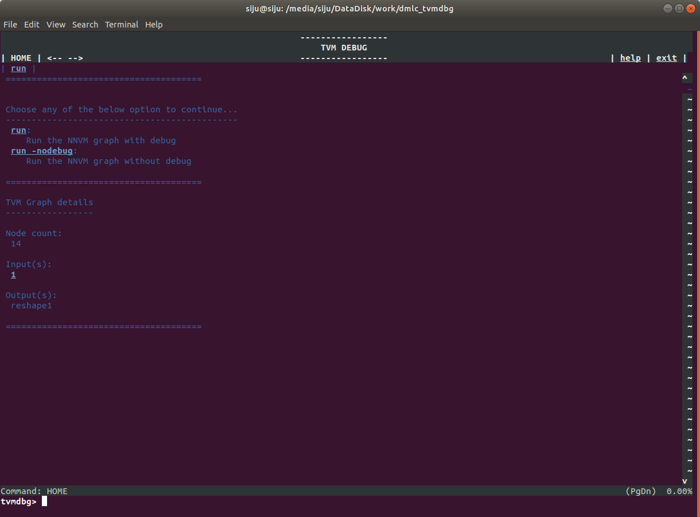
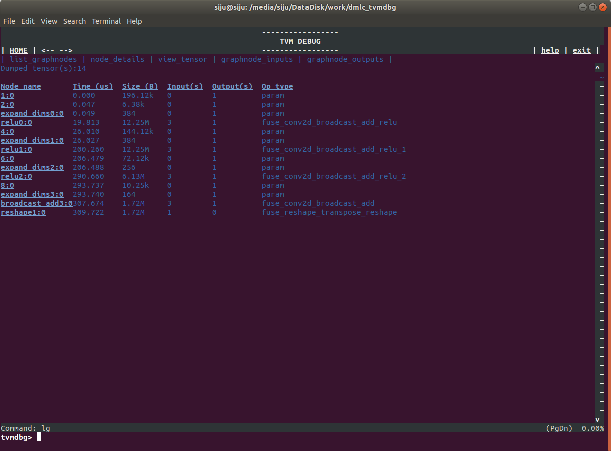
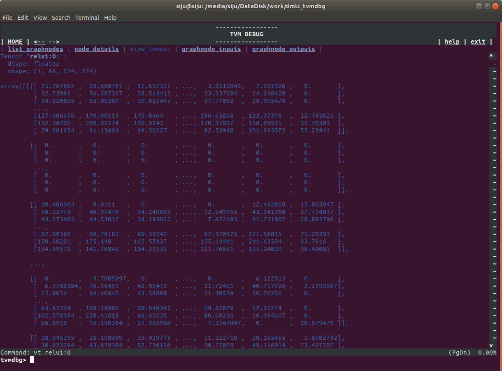
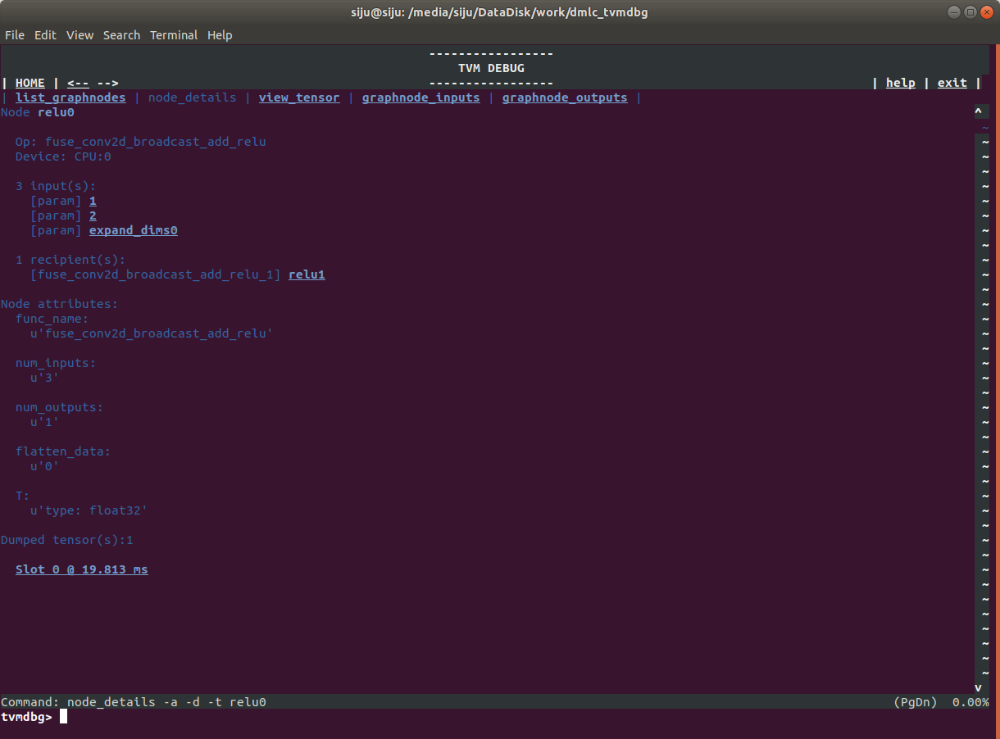
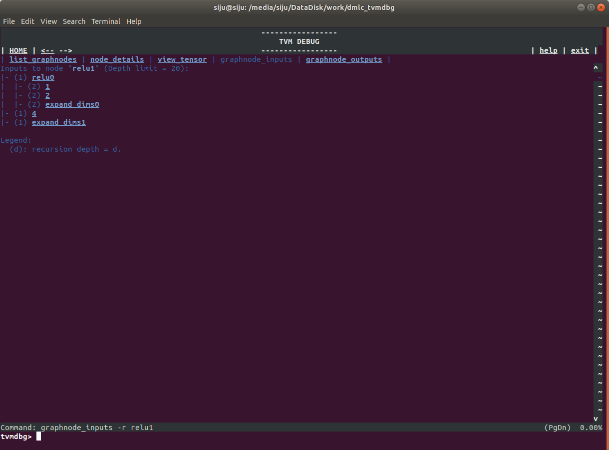
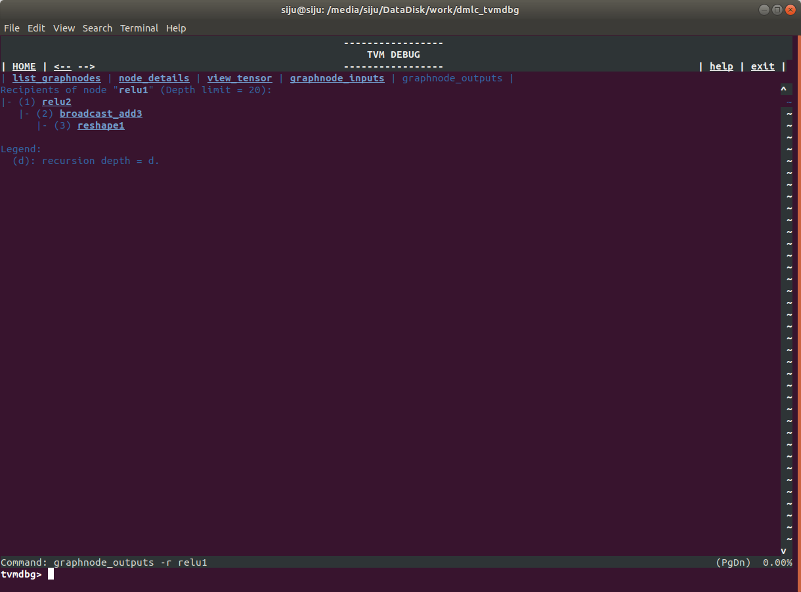

**TVMDBG**

TVM Debugger (TVMDBG) is a UI based specialized debugger for TVM&#39;s computation graphs. It provides access to internal graph structures and tensor values at TVM runtime.

**Why**  **TVMDBG**
In TVM&#39;s current computation-graph framework, almost all actual computation after graph construction happens in a single Python function. Basic Python debugging tools such as [pdb](https://docs.python.org/2/library/pdb.html) cannot be used to debug tvm.run, due to the fact that TVM&#39;s graph execution happens in the underlying C++ layer. C++ debugging tools such as [gdb](https://www.gnu.org/software/gdb/) are not ideal either, because of their inability to recognize and organize the stack frames and variables in a way relevant to TVM&#39;s operations, tensors and other graph constructs.

TVMDBG addresses these limitations. Among the features provided by TVMDBG, the following ones are designed to facilitate runtime debugging of TVM:
- Easy access enabling debug by setting a variable while creating graphruntime.
- Inspection of runtime ops output values and node connections

**Note:** The TVM debugger uses a curses-based text user interface.

**How to use TVMDBG?**
```
#Create the graph run time
m = graph_runtime.create(graph, lib, ctx, debug=True)

# set inputs
m.set_input('data', tvm.nd.array(data.astype(dtype)))
m.set_input(**params)

# execute
m.run()
```
Enabling the ```debug=True``` flag will bring up the CLI during run.

The HOME page of tvmdbg looks like below.
 
 
Here user will get the option to run with or without debugging.
Once user perfoms the run, it will take you for listing the nodes in graph.
 
 
By clicking at the **Node name** user can see the node details, like its 
1. Node information and its attributes
2. Node inputs
3. Node outputs
4. Its computations output values
 
 
 
 


**Limitations:**
1. Can dump only fused graph, if need to see each and every operation seperately, disable the nnvm optimizations
2. Layer information will be dispersed into multiple operators.
