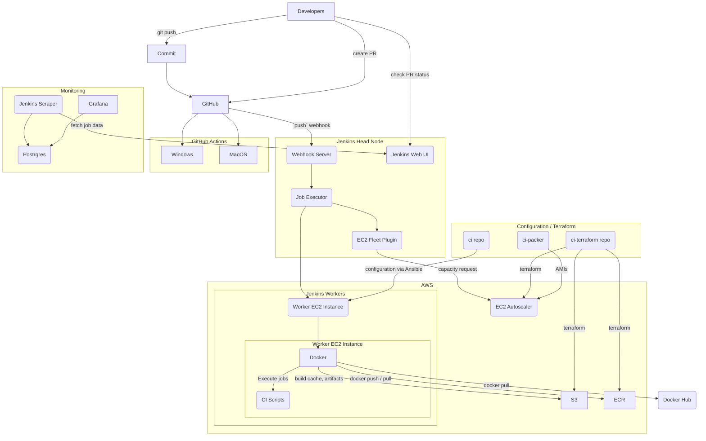

<!--- Licensed to the Apache Software Foundation (ASF) under one -->
<!--- or more contributor license agreements.  See the NOTICE file -->
<!--- distributed with this work for additional information -->
<!--- regarding copyright ownership.  The ASF licenses this file -->
<!--- to you under the Apache License, Version 2.0 (the -->
<!--- "License"); you may not use this file except in compliance -->
<!--- with the License.  You may obtain a copy of the License at -->

<!---   http://www.apache.org/licenses/LICENSE-2.0 -->

<!--- Unless required by applicable law or agreed to in writing, -->
<!--- software distributed under the License is distributed on an -->
<!--- "AS IS" BASIS, WITHOUT WARRANTIES OR CONDITIONS OF ANY -->
<!--- KIND, either express or implied.  See the License for the -->
<!--- specific language governing permissions and limitations -->
<!--- under the License. -->

# TVM CI

TVM runs CI jobs on every commit to an open pull request and to branches in the apache/tvm repo (such as `main`). These jobs are essential to keeping the TVM project in a healthy state and preventing breakages. Jenkins does most of the work in running the TVM tests, though some smaller jobs are also run on GitHub Actions.

## GitHub Actions

GitHub Actions is used to run Windows jobs, MacOS jobs, and various on-GitHub automations. These are defined in [`.github/workflows`](../.github/workflows/). These automations include bots to:
* [cc people based on subscribed teams/topics](https://github.com/apache/tvm/issues/10317)
* [allow non-committers to merge approved / CI passing PRs](https://discuss.tvm.apache.org/t/rfc-allow-merging-via-pr-comments/12220)
* [add cc-ed people as reviewers on GitHub](https://discuss.tvm.apache.org/t/rfc-remove-codeowners/12095)
* [ping languishing PRs after no activity for a week (currently opt-in only)](https://github.com/apache/tvm/issues/9983)
* [push a `last-successful` branch to GitHub with the last `main` commit that passed CI](https://github.com/apache/tvm/tree/last-successful)

https://github.com/apache/tvm/actions has the logs for each of these workflows. Note that when debugging these workflows changes from PRs from forked repositories won't be reflected in the PR. These should be tested in the forked repository first and linked in the PR body.


## Keeping CI Green

Developers rely on the TVM CI to get signal on their PRs before merging.
Occasionally breakages slip through and break `main`, which in turn causes
the same error to show up on an PR that is based on the broken commit(s). Broken
commits can be identified [through GitHub](https://github.com/apache/tvm/commits/main>)
via the commit status icon or via [Jenkins](https://ci.tlcpack.ai/blue/organizations/jenkins/tvm/activity?branch=main>).
In these situations it is possible to either revert the offending commit or
submit a forward fix to address the issue. It is up to the committer and commit
author which option to choose, keeping in mind that a broken CI affects all TVM
developers and should be fixed as soon as possible.

Some tests are also flaky and fail for reasons unrelated to the PR. The [CI monitoring rotation](https://github.com/apache/tvm/wiki/CI-Monitoring-Runbook) watches for these failures and disables tests as necessary. It is the responsibility of those who wrote the test to ultimately fix and re-enable the test.


## Dealing with Flakiness

If you notice a failure on your PR that seems unrelated to your change, you should
search [recent GitHub issues related to flaky tests](https://github.com/apache/tvm/issues?q=is%3Aissue+%5BCI+Problem%5D+Flaky+>) and
[file a new issue](https://github.com/apache/tvm/issues/new?assignees=&labels=&template=ci-problem.md&title=%5BCI+Problem%5D+>)
if you don't see any reports of the failure. If a certain test or class of tests affects
several PRs or commits on `main` with flaky failures, the test should be disabled via
[pytest's @xfail decorator](https://docs.pytest.org/en/6.2.x/skipping.html#xfail-mark-test-functions-as-expected-to-fail) with [`strict=False`](https://docs.pytest.org/en/6.2.x/skipping.html#strict-parameter) and the relevant issue linked in the
disabling PR.

```python
@pytest.mark.xfail(strict=False, reason="Flaky test: https://github.com/apache/tvm/issues/1234")
    def test_something_flaky():
        pass
```

Then submit a PR as usual

```bash
git add <test file>
git commit -m'[skip ci][ci] Disable flaky test: `<test_name>`

See #<issue number>
'
gh pr create
```

## Network Resources

Downloading files from the Internet in CI is a big source of flaky failures
(e.g. remote server goes down or is slow), so try to avoid using the network at
all during tests. In some cases this isn't a reasonable proposition (e.g. the
docs tutorials which need to download models). In these cases you can re-host
files in S3 for fast access in CI. A committer can upload a file, specified by
a name, hash, and path in S3, using the `workflow_dispatch` event on
[the `upload_ci_resource.yml` GitHub Actions workflow](https://github.com/apache/tvm/actions/workflows/upload_ci_resource.yml).
The sha256 must match the file or it will not be uploaded. The upload path is
user-defined so it can be any path (no trailing or leading slashes allowed) but
be careful not to collide with existing resources on accident.
    
## Skipping CI

For reverts and trivial forward fixes, adding `[skip ci]` to the revert's
PR title will cause CI to shortcut and only run lint. Committers should
take care that they only merge CI-skipped PRs to fix a failure on `main` and
not in cases where the submitter wants to shortcut CI to merge a change faster.
The PR title is checked when the build is first run (specifically during the lint
step, so changes after that has run do not affect CI and will require the job to
be re-triggered by another `git push`).

```bash
# Revert HEAD commit, make sure to insert '[skip ci]' at the beginning of
# the commit subject
git revert HEAD
git checkout -b my_fix
# After you have pushed your branch, create a PR as usual.
git push my_repo
# Example: Skip CI on a branch with an existing PR
# Adding this commit to an existing branch will cause a new CI run where
# Jenkins is skipped
git commit --allow-empty --message "[skip ci] Trigger skipped CI"
git push my_repo
```

## Docker Images

Each CI job runs most of its work inside a Docker container, built from files
in the [`docker/`](../docker) folder. These
files are built nightly in Jenkins via the [docker-images-ci](https://ci.tlcpack.ai/job/docker-images-ci/>) job.
The images for these containers are hosted in the [tlcpack Docker Hub](https://hub.docker.com/u/tlcpack>)
and referenced in the [`Jenkinsfile.j2`](Jenkinsfile.j2). These can be inspected and run
locally via standard Docker commands.

### `ci-docker-staging`

The [ci-docker-staging](https://github.com/apache/tvm/tree/ci-docker-staging>)
branch is used to test updates to Docker images and `Jenkinsfile` changes. When
running a build for a normal PR from a forked repository, Jenkins uses the code
from the PR except for the `Jenkinsfile` itself, which comes from the base branch.
When branches are built, the `Jenkinsfile` in the branch is used, so a committer
with write access must push PRs to a branch in apache/tvm to properly test
`Jenkinsfile` changes. If your PR makes changes to the `Jenkinsfile`, make sure
to @ a [committer](../CONTRIBUTORS.md>)
and ask them to push your PR as a branch to test the changes.

# Jenkins CI

TVM uses Jenkins for running Linux continuous integration (CI) tests on
[branches](https://ci.tlcpack.ai/job/tvm/) and
[pull requests](https://ci.tlcpack.ai/job/tvm/view/change-requests/) through a
build configuration specified in a [`Jenkinsfile`](../Jenkinsfile).
Other jobs run in GitHub Actions for Windows and MacOS jobs.

## `Jenkinsfile`

The template files in this directory are used to generate the [`Jenkinsfile`](../Jenkinsfile) used by Jenkins to run CI jobs for each commit to PRs and branches.

To regenerate the `Jenkinsfile`, run

```bash
python3 -mvenv _venv
_venv/bin/pip3 install -r jenkins/requirements.txt
_venv/bin/python3 jenkins/generate.py
```

# Infrastructure

Jenkins runs in AWS on an EC2 instance fronted by an ELB which makes it available at https://ci.tlcpack.ai. These definitions are declared via Terraform in the [tlc-pack/ci-terraform](https://github.com/tlc-pack/ci-terraform) repository. The Terraform code references custom AMIs built in [tlc-pack/ci-packer](https://github.com/tlc-pack/ci-packer). [tlc-pack/ci](https://github.com/tlc-pack/ci) contains Ansible scripts to deploy the Jenkins head node and set it up to interact with AWS.

The Jenkins head node has a number of autoscaling groups with labels that are used to run jobs (e.g. `CPU`, `GPU` or `ARM`) via the [EC2 Fleet](https://plugins.jenkins.io/ec2-fleet/) plugin.

## Deploying

Deploying Jenkins can disrupt developers so it must be done with care. Jobs that are in-flight will be cancelled and must be manually restarted. Follow the instructions [here](https://github.com/tlc-pack/ci/issues/10) to run a deploy.

## Monitoring

Dashboards of CI data can be found:
* within Jenkins at https://ci.tlcpack.ai/monitoring (HTTP / JVM stats)
* at https://monitoring.tlcpack.ai (job status, worker status)

## CI Diagram

This details the individual parts that interact in TVM's CI. For details on operations, see https://github.com/tlc-pack/ci.


